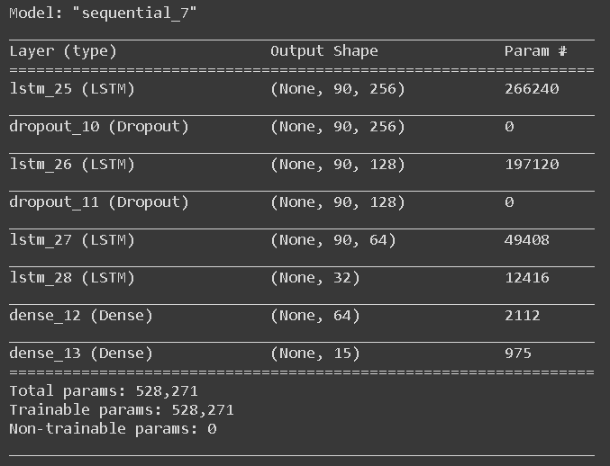
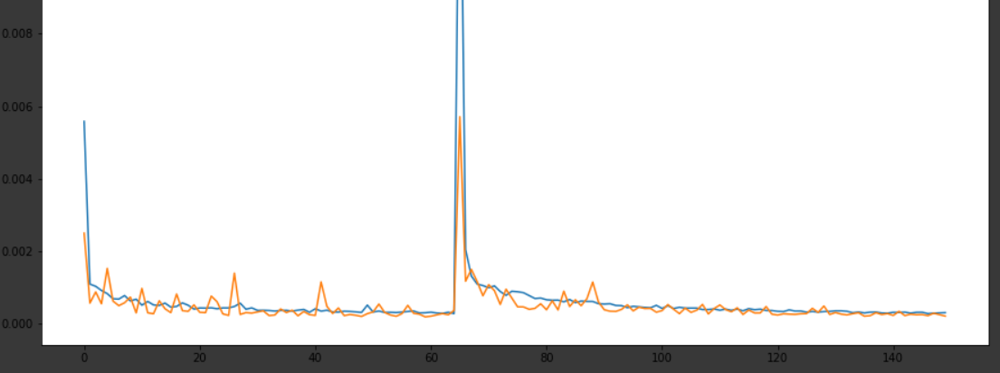

# StockPrice-Prediction 
Time series model for predicting the stock price. The Example is taken on the share of Nifty. 
# Model  
The model consists of LSTM and dropout.  LSTM are used because they are capable of remembering the past values and use them to predict the future value. Here lookback is 90 days.  
  
# Loss  
The loss function is mean squared error and optimizer is adam  
  
